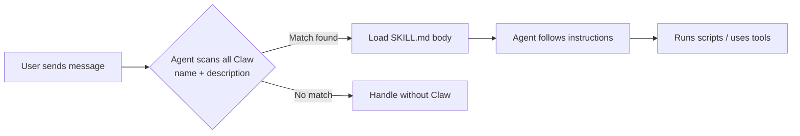

# 🦞 PicoClaw Skills (Claws) — Tutorial

## What is a Claw?

A **Claw** (Skill) is a modular package that teaches PicoClaw *how* to do something specific. Without a Claw, the agent is a generalist. With one, it becomes a specialist — equipped with procedures, scripts, and domain knowledge that no model inherently has.

**Example:** The `weather` Claw teaches PicoClaw to fetch forecasts via `curl`. The `github` Claw teaches it to use the `gh` CLI for PRs and issues.

---

## How Claws Work (Lifecycle)



1. **Metadata always loaded** — Every Claw's `name` + `description` (~100 words) is always in context
2. **Body loaded on trigger** — The full `SKILL.md` instructions load only when the description matches the user's intent
3. **Resources loaded on demand** — Scripts, references, assets are read only when the agent needs them

This is called **Progressive Disclosure** — it keeps the context window lean.

---

## Workspace Sessions & Memory Limits

PicoClaw records short-term chat histories in the `workspace/sessions/` directory. Each active conversation (e.g., CLI, Discord, Telegram) gets its own `.json` file containing the precise transcript of user prompts, assistant replies, and tool executions.

**Auto-Summarization Limits:**
To prevent the LLM's context window from overflowing with massive transcripts, PicoClaw implements auto-summarization. It does not record infinitely. By default, a session will automatically summarize itself when:
- The conversation reaches **20 messages** total.
- Or, the conversation size takes up **50% of the total tokens** allowed for your model.

When this triggers, the LLM condenses the entire history into a single paragraph, saves it as the session `Summary`, and **truncates the history to only the last 4 messages**. The summary remains at the top of the context so the agent doesn't forget the broader chat.

**Configuration:**
These limits are fully adjustable. You can override them in your `config.json` without breaking the system:
```json
{
  "agents": {
    "defaults": {
      "summarize_message_threshold": 50,
      "summarize_token_percent": 75
    }
  }
}
```

---

## Anatomy of a Claw

```
my-claw/
├── SKILL.md              ← Required. The brain of the Claw.
│   ├── YAML frontmatter  ← name + description (triggers the Claw)
│   └── Markdown body     ← Instructions (loaded after trigger)
│
└── Optional resources/
    ├── scripts/           ← Deterministic code (Python/Bash)
    ├── references/        ← Docs the agent reads when needed
    └── assets/            ← Files used in output (templates, images)
```

### SKILL.md — The Only Required File

Every Claw has exactly one `SKILL.md` with two parts:

#### 1. Frontmatter (YAML) — The Trigger

```yaml
---
name: weather
description: Get current weather and forecasts (no API key required).
---
```

> [!IMPORTANT]
> The `description` is **everything**. The agent reads it to decide whether to activate this Claw. If your description is vague, the Claw won't trigger. If it's too broad, it'll trigger for unrelated tasks.

**Good description:**
> *"Read and extract text from Office documents (.docx, .xlsx, .pptx, .pdf, .csv), then summarize content. Use when the user asks to read, summarize, or extract information from document files."*

**Bad description:**
> *"Document stuff."*

#### 2. Body (Markdown) — The Instructions

This is what the agent reads *after* the Claw triggers. Write it as if you're onboarding a smart colleague:

- **What to do** — Step-by-step procedures
- **How to do it** — Code examples, CLI commands
- **When to use which approach** — Decision trees for edge cases

---

## The Three Resource Types

| Resource | Purpose | When to use | Example |
|---|---|---|---|
| **scripts/** | Code that runs deterministically | Repeated tasks, fragile operations | `scripts/extract_text.py` |
| **references/** | Docs loaded into agent context | Domain knowledge, schemas, APIs | `references/api_docs.md` |
| **assets/** | Files used in output (not read) | Templates, images, boilerplate | `assets/template.docx` |

### When to Use Scripts vs Instructions

| Scenario | Use Script | Use Instructions |
|---|---|---|
| Binary file parsing (docx, xlsx) | ✅ | ❌ |
| Complex multi-step CLI commands | ✅ | ❌ |
| Simple one-liner shell commands | ❌ | ✅ |
| Decisions requiring judgment | ❌ | ✅ |
| Same code rewritten every time | ✅ | ❌ |

---

## Writing an Excellent Claw — Best Practices

### 1. Keep SKILL.md Under 500 Lines

The context window is shared. Every token your Claw uses is a token stolen from the conversation. Be ruthless:

- ❌ *"The write_file tool can be used to write content to a file on disk"* — The agent already knows this
- ✅ *"Write summary to the user-specified path using write_file"* — Adds actionable context

### 2. Description is Your #1 Priority

Spend 80% of your design time on the `description`. Include:
- **What** the Claw does
- **When** to trigger (specific phrases, file types, scenarios)
- **What NOT** to use it for (prevents false triggers)

### 3. Separate Extraction from Intelligence

Let scripts handle **mechanical work** (parsing, extraction, formatting). Let the agent handle **intelligent work** (summarizing, deciding, responding). Don't try to make a script summarize — the LLM is better at that.

### 4. Design for Speed

- Cap data extraction (e.g., first 100 rows of a spreadsheet)
- Stream output to stdout rather than writing temp files
- Auto-install dependencies inline rather than requiring setup

### 5. Leverage Injected Context
Before writing an extensive Python script to read a file, ask yourself if the agent *already* has access to it. For example, `workspace/memory/MEMORY.md` is automatically injected into the agent's system prompt on every turn. 

A skill designed to add memories does not need to parse or read `MEMORY.md` using scripts or tools. It already knows the contents! It can simply use the native `write_file` tool to overwrite the file with the new addition, saving massive computing power and an entire LLM round-trip.

### 6. Use Progressive Disclosure

If your Claw supports multiple workflows, split them:

```
multi-format-claw/
├── SKILL.md                    ← Core workflow + navigation
└── references/
    ├── docx_patterns.md        ← Loaded only for .docx tasks
    ├── spreadsheet_patterns.md ← Loaded only for .xlsx tasks
    └── presentation_tips.md    ← Loaded only for .pptx tasks
```

### 7. Handle Errors Gracefully

In scripts, always print clear error messages the agent can relay:
```python
if not os.path.exists(path):
    print(f"ERROR: File not found: {path}", file=sys.stderr)
    sys.exit(1)
```

---

## Real Examples from This Workspace

### Minimal Claw — `weather`
Just a `SKILL.md` with `curl` one-liners. No scripts, no references. Simple and effective.

### Script-Based Claw — `tmux`
Has `scripts/` directory for reliable tmux operations. The script handles the fragile part, instructions handle the judgment.

### Reference-Heavy Claw — `hardware`
Has `references/` for hardware documentation. Agent loads relevant docs based on the device being discussed.

### Meta Claw — `skill-creator`
The most comprehensive Claw — it teaches the agent how to *create other Claws*. Uses the full anatomy with detailed procedural instructions.

---

## Quick-Start Checklist

- [ ] Create folder: `workspace/skills/my-claw/`
- [ ] Write `SKILL.md` with YAML frontmatter (`name` + `description`)
- [ ] Write concise body instructions (imperative form, <500 lines)
- [ ] Add `scripts/` if mechanical work is needed
- [ ] Add `references/` if domain docs are needed
- [ ] Test by asking PicoClaw a trigger phrase
- [ ] Iterate based on real usage
